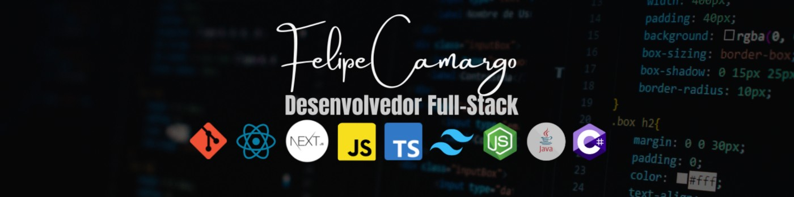

### <h1 align="center"> Olá! Eu sou o Felipe👋</h1>

Tenho paixão por tecnologia & inovação, planejar, liderar projetos e transformar ideias criativas em soluções reais.

<b>Me inspiro em virtudes como persistência, visão estratégica, liderança e, acima de tudo, no impacto social positivo que podemos gerar através do nosso trabalho.</b>

  

---

<h2 align="center">📫 Contato</h2>

  
  
  

---

## 🧭 Sobre mim

Sou **Desenvolvedor Full Stack +4 anos**, com especialidade em **aplicações web com React/Next.js** e apoio na construção de **APIs em sistemas com .NET/C# e Node.js**.

- 💻 No dia a dia, desenvolvo e evoluo sistemas em produção: da interface à integração com o back-end.
- 🧭 Tenho experiência em **liderança técnica** em projetos: defino arquitetura, organizo escopo e acompanho o time do requisito a entrega.
- 🎯 Prezo por código limpo, documentação, parceria em equipe, entregas previsíveis e tecnologia que resolve problemas reais.

---

<h2 align="center">💻 Tecnologias que eu uso</h2>

    
    

---

## 📂 Projetos em destaque

| Projeto | Descrição | Stack |
|---|---|---|
| 🏢 **[Feltec Solutions](https://www.feltecsolutions.com.br)** | Site institucional multilíngue com CMS headless | Next.js · Tailwind · Cosmic |

> 🔒 Parte dos projetos é de clientes e fica em repositórios privados. Fale comigo para uma demonstração.

---

<h2 align="center">📊 GitHub Stats</h2>

  <a href="https://github.com/Felipe-Camargo12">
  
  

---

  <b>💬 Tem um projeto em mente? Vamos conversar.</b> 
  <a href="https://www.feltecsolutions.com.br">feltecsolutions.com.br</a>

<i>Tecnologia que Impulsiona Negócios.</i>

